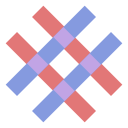
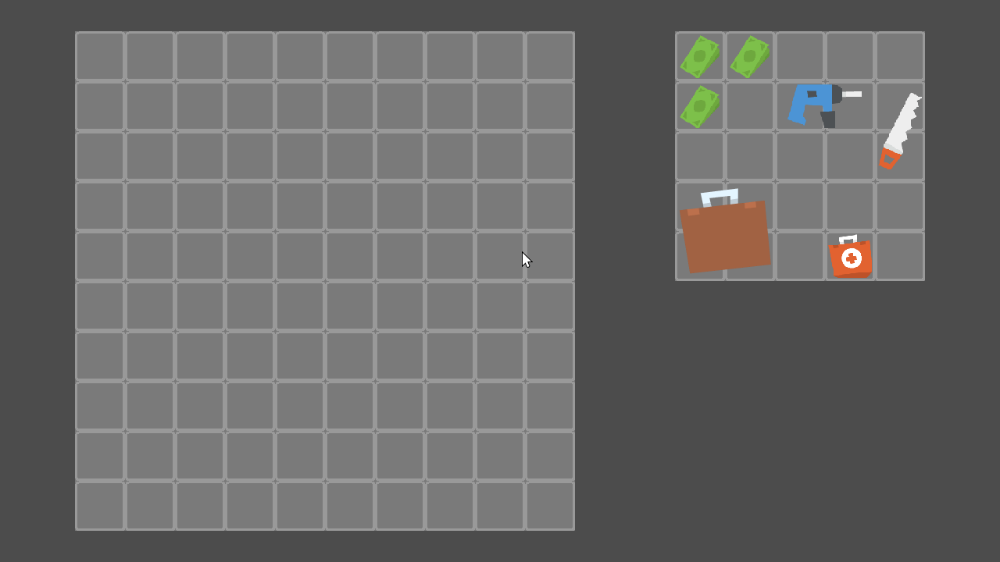

# Criss-Cross
 \
A simple Godot addon that adds generic **grid** nodes for quickly building grid-based systems, in **2D** or **3D**.

# ✨ Nodes

## Grid2D

A grid in the X and Y axis which contains values for each cell. It can be `infinite`, or generate cells with `regions`.\
In the example at `scenes/demos/inventory`, it is used to make an inventory system similar to those found in games like Escape from Tarkov or Kenshi. 

## Grid3D

A grid in the X and Z axis which contains values for each cell. It can be `infinite`, or generate cells with `regions`.\
In the example at `scenes/demos/building_3d`, it is used to make a ~~(terrible looking)~~ building system.

# ❓ How to use
Check out the **built-in documentation** in your Godot project for explanations of every relevant function and variable.

> You can find it by searching for `Grid2D` or `Grid3D` with the `Search help` button in the script editor or by pressing the `documentation` button in the node's inspector.\
> 
> 

# 🔧 Installation Steps

1. **Download the project files.**
2. Move the `criss-cross` folder into your `/addons` folder within your Godot project.
3. Enable the addon through the project settings.

# Credits

All assets by [Kenney](https://www.kenney.nl)
